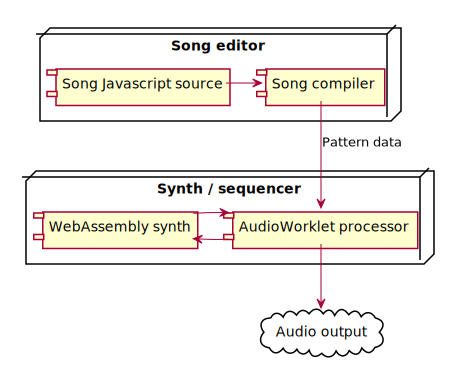

Wasm-music
==========

Demonstrated at the [WebAssembly Summit 2020](https://webassembly-summit.org):

https://youtu.be/C8j_ieOm4vE

Go to [petersalomonsen.com](https://petersalomonsen.com) for the hosted version. Or have a look at [demo videos](https://www.youtube.com/watch?v=C8j_ieOm4vE&list=PLv5wm4YuO4IxRDu1k8fSBVuUlULA8CRa7).

# Overview diagram

The synthesizer itself is written in [AssemblyScript](https://assemblyscript.org), and contains simple oscillators, filters, delay, reverb and more. It also contains a simple pattern sequencer with the same structures as in [4klang](../4klang/), and so you can use the same javascript API when programming music. The difference is though when it comes to defining instruments as you have the full flexibility of writing the code as can be seen in the examples here [synth1/assembly/instruments](synth1/assembly/instruments). You'd also have to build a mix for your song as can be seen in the [synth1/assembly/mixes](synth1/assembly/mixes) folder, and also reference it from [synth1/assembly/index.ts](synth1/assembly/index.ts).

A synth WebAssembly module is small, and the current examples typically less than 16kb. By embedding the pattern data in the Wasm, you can create tiny webapps or executables playing music.

[AudioWorklet](https://developer.mozilla.org/en-US/docs/Web/API/AudioWorklet) is used for playing music on the web with low latency, and this is currently only supported for the Chrome web browser. I've written a [polyfill](audioworkletpolyfill.js) for being able to play in other browsers, but you don't get the low latency.

Go to https://petersalomonsen.com for resources like articles, videos and examples. Also there are  my [gists](https://gist.github.com/petersalomonsen). You can easily load music from a gist by referencing to it in the URL, e.g.:

https://petersalomonsen.com/webassemblymusic/livecodev2/?gist=a74d2d036b3ecaa01af4e0f6d03ae7c4

# Build / Run / Export to WAW

**Build**:

from the [synth1](synth1) folder:

`npm run createbrowsersourcebundle`

this will create a json containing all the sources for the AssemblyScript compiler running in the browser.

If you want to build the webassembly synth directly:

`npm run asbuild` (for optimized build)

`npm run fastbuild` (for faster build and wat file)

**Run**:

`npm run serve`

Browse to http://localhost:5000

**Export to wav**:

from the [synth1](synth1) folder.

the [synth1/index.js](synth1/index.js) script will output audio to `stdout`, so you may pipe it into e.g. [SoX]([sox](http://sox.sourceforge.net/)) like this:

`node index.js | sox -S -t raw -b 32 -e float -r 44100 -c 2 - out.wav`

## Export to Wasm in the browser

In the browser there's a button in the upper right with download icon with tooltip `Export Wasm`.
Pressing this will generate and download a `Wasm` file.

You can run this `Wasm` file in the browser, NodeJS or with a WebAssembly runtime like [Wasm3](https://github.com/wasm3/wasm3) or [Wasmer](https://wasmer.io/).

See examples with Wasm3 here: https://github.com/wasm3/wasm3/tree/master/test/benchmark/wasmsynth

You can the Wasm file to export raw audio data and import into e.g. Audacity with 32-bit float, little endian, stereo.

`wasmer song.wasm > song.raw`

Play directly from Wasmer by piping to sox:

`wasmer song.wasm | sox -S -t raw -b 32 -e float -r 44100 -c 2 - -d`

Create wav directly from Wasmer by piping to sox:

`wasmer song.wasm | sox -S -t raw -b 32 -e float -r 44100 -c 2 - song.wav`

or use the exported Wasm binary from nodejs or the browser.

## Exporting Wasm to png

If you choose to export the Wasm as a png file you can also compress it further by using e.g. `oxipng`. In ase of compress it remember to disable gray scale reduction ( as this is not supported by Safari ):

`oxipng --ng music.wasm.png`

# Exporting Shader videos

You can export video without sound from the web app. To mux it with the audio try using FFMPEG with this command:

`ffmpeg -i video.mp4 -i exportedsong.wav -c:v copy -c:a aac -b:a 256k output.mp4`

Often when creating videos like this you'd want them to be able to loop seamless. Unfortunately most players will have a very small, but noticable delay when looping. An alternative is to use ffmpeg to loop the output video:

`ffmpeg -stream_loop 3 -i input.mp4 -c copy output_looped.mp4`

# Embedding videos

Convert them for intra-frame:

`ffmpeg -i movie.mp4 -c:v libx264 -intra movie2.mp4`

# Final words

**`Wasm` should be pronounced like `awesome` starting with a `W`**

https://www.youtube.com/watch?v=C8j_ieOm4vE&t=1650s
