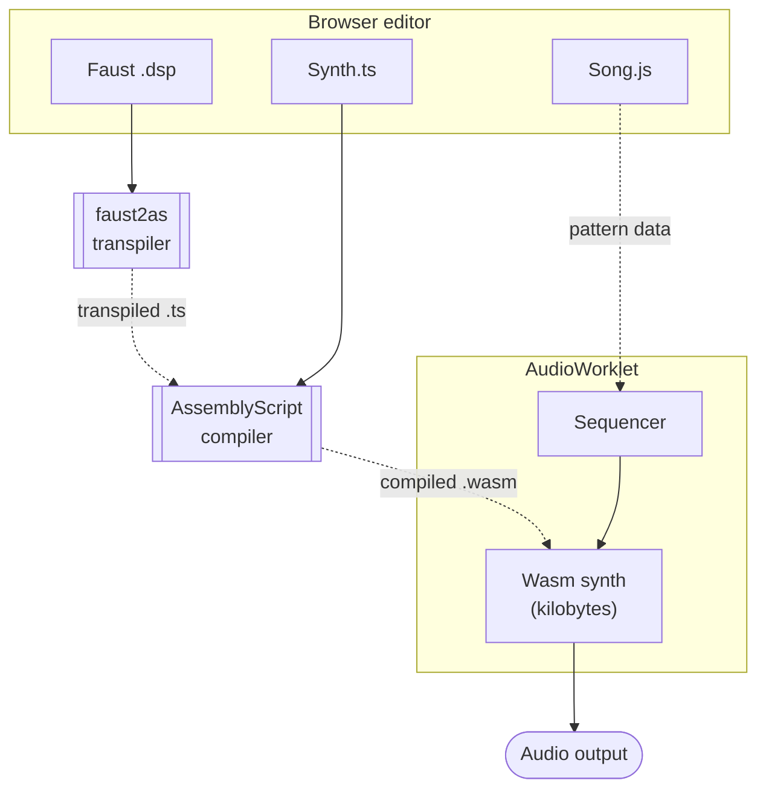

# Converting Faust to AssemblyScript for WebAssembly Music

Peter Salomonsen
petersalomonsen.com · github.com/petersalomonsen/javascriptmusic

IFC 2026 · Université Côte d'Azur

<!--
Speaker notes:
  - 20-30s. Hello, name, what we're going to do for the next half hour.
  - Mention the demo at the end so they know to expect sound.
-->

---

## Slide 2 — What is WebAssembly Music?

> Browser-based live-coding environment for music.
> JavaScript sequences. AssemblyScript synthesizers. Compiled to
> WebAssembly *in the browser* on every save.

- One wasm module → multi-timbral MIDI synth with voice allocation
- Sample-by-sample processing
- AudioWorklet for low-latency playback
- Synth wasm modules: kilobytes, not megabytes

**▶ Demo** — the running app: play a song, tour the editors.

<!--
Speaker notes:
  - Set up the architecture diagram on the next slide. The single-wasm-
    module point is the key one for the Faust integration story later.
  - Quick app tour here — keep it short; the deep live-coding demo is
    slide 14.
-->

---

## Architecture



<!--
Speaker notes:
  - Walk through the diagram left-to-right, top-to-bottom: three editable
    source files → two compile paths converging on the wasm synth →
    AudioWorklet runtime → audio.
  - The Faust → faust2as → AS-compiler arrow is the talk's thesis;
    everything later expands on it.
-->

---

## Slide 3 — Why does it exist?

The origin chain (from the project's own README):

1. **NodeJS + MIDI** controlling ZynAddSubFX. Songs as JS files. Worked,
   but the synth was a black box.
2. **4klang** — compact synth from the 64K demoscene tradition, which
   > *"finally inspired me to attempt writing a synth in WebAssembly
   > running entirely in the browser."*
3. **WebAssembly synth in the browser, written in AssemblyScript.**
   First commits July 2018. AudioWorklet integration Nov 2018.

<!--
Speaker notes:
  - Read the README quote out loud — it's the actual origin statement
    and grounds everything that follows.
  - 4klang and the demoscene reference is for taste-setting (tiny
    binaries, code-as-sound). Don't dwell if the audience isn't with
    you on it.
-->

---

## Slide 4 — Why AssemblyScript?

Fast in-browser compile is the deciding factor.

| Alternative                | Why not                                           |
| -------------------------- | ------------------------------------------------- |
| Rust + wasm-pack           | Toolchain compile time too slow for "edit → hear" |
| Emscripten + C             | Same                                              |
| Hand-written WAT           | No abstraction; tedious                           |
| **AssemblyScript**         | Compiles in *milliseconds*, runs as a Worker      |

TypeScript-like syntax, but doesn't hide the wasm — class layout, raw
memory, predictable codegen all still in your hands.

> Without ms-scale compile, the rest of the project's save-and-hear
> feedback loop doesn't work.

<!--
Speaker notes:
  - This is the load-bearing engineering decision. Spend ~45s on it.
  - If asked: "but isn't Rust faster at runtime?" — yes, marginally,
    but irrelevant if you can't iterate. Live coding > peak perf.
-->

---

## Slide 5 — Where Faust fits

Faust = widely adopted DSP language; mature instrument libraries
(physical models, FM synths, mastering chains).

**This talk:** make Faust instruments available *inside* WebAssembly
Music — not as separate AudioWorklet nodes, but as voices in one
**multi-timbral** synth engine, compiled into a single wasm module.

> *Polyphonic* = many notes, one instrument.
> *Multi-timbral* = many instruments at once, one per MIDI channel
> (piano + bass + drums together).

**▶ Demo** — the app: a multi-timbral Faust song in one module.

<!--
Speaker notes:
  - Be respectful about Faust IDE / faustwasm — they're great tools
    with different goals. Position as "a different choice for a
    different use case," not "we do it better."
  - Multi-timbral: define polyphony first (many notes, one sound), then
    multi-timbral (many sounds at once, one per channel). The DX7 demo
    has e-piano/bass/strings/drums on channels 0–4 simultaneously.
  - The comparison table is on the next slide.
-->

---

## Slide 5b — faustwasm runtime vs. WebAssembly Music

|                  | Faust IDE / `faustwasm` runtime               | WebAssembly Music + transpiler                          |
| ---------------- | --------------------------------------------- | ------------------------------------------------------- |
| Per DSP          | One AudioWorklet node, polyphonic, one timbre | One `MidiVoice` subclass compiled into the shared module |
| Many instruments | Wire up N separate nodes in the audio graph   | Many Faust instruments **+ effects** in **one** module  |
| Routing          | MIDI channel ignored (`not used for now`)     | Channel → instrument: **multi-timbral** out of the box  |
| Where it runs    | Browser Web Audio graph                       | Same wasm runs in the browser **and as a DAW plugin**   |

<!--
Speaker notes:
  - faustwasm DOES manage voices — its poly node has a real voice pool
    with stealing. What it does NOT do: route MIDI channel to different
    instruments (keyOn's channel arg is "not used for now"), or put
    several instruments in one module. So the value WAW adds is
    multi-timbral routing + one shared module, not "voice management".
  - DAW plugin: the EXPORTED .wasm (the same midisynth binary) loads in
    a JUCE/WasmEdge plugin via the same exports the AudioWorklet uses
    (shortmessage / fillSampleBufferWithNumSamples / samplebuffer). One
    binary, browser and DAW. See dawplugin/ in the repo.
  - Source-to-source is the architectural commitment that follows
    from the single-wasm-module design.
-->

---

## Slide 6 — Two transpiler paths

Both emit the same shape. Different starting languages.

| | `faust2as.js` (the abstract) | `faust2asc.js` (post-abstract) |
| --- | --- | --- |
| Faust output stage | `faust -lang c` | `faust -lang asc` (via `@psalomo/faustwasm`) |
| Where it runs | Node CLI, offline | Node CLI **and in the browser** |
| Live-coding workflow | Save .dsp → re-run CLI → reload | Save .dsp in the editor → DSP recompiles and hot-swaps |

→ **Both** produce typed AssemblyScript channel classes with public
UI-param fields, CC/NRPN auto-mapping, doc comments. Indistinguishable
to the user once compiled.

<!--
Speaker notes:
  - Flag that the ASC backend is the new piece since the abstract was
    submitted. Audience members who read the abstract may expect only
    the C-backend story; introduce the second path here.
-->

---

## Slide 7 — faust2as · the C-backend path

The story from the abstract.

```
faust -lang c your_dsp.dsp  →  C source
                              ↓  faust2as.js parses & reshapes
                              ↓
                              AssemblyScript class extending MidiVoice
```

Transpiler responsibilities:

- Type conversions (`(float)x` → `<f32>x`, `int` → `i32`)
- Field access (`dsp->fHslider0` → `this.fHslider0`)
- C math intrinsics (`fminf` → `Mathf.min`, `expf` → `Mathf.exp`, …)
- Wave tables, static array declarations
- UI metadata harvested from `ui_interface->declare(...)` calls

→ Output compiles through the same in-browser AS pipeline as
hand-written instruments.

**▶ Demo** — the C backend: `faust2as.js` on a `.dsp` at the CLI.

<!--
Speaker notes:
  - One concrete code-side-by-side here would help — pick a 5-line
    snippet (e.g. a single Faust slider becoming a `this.feedback`
    read) for the slide background.
-->

---

## Slide 8 — UI param mapping (auto)

What you get without writing any glue code:

- **CC mapping**: Faust UI params auto-assigned to sequential MIDI CC
  numbers, skipping reserved ones (7 volume, 10 pan, 64 sustain, …).
- **NRPN fallback**: when an instrument has more than 116 controllable
  params, auto-switch to NRPN encoding (CC 99 / 98 / 6).
  - DX7 example: 139 params per algorithm → NRPN required.
- **Typed channel fields**: every param becomes a `f32` field on the
  channel class with a doc comment carrying its init/min/max/step. The
  editor's hover docs serve as the missing Faust UI.

```ts
/** Feedback [init: 0, min: 0, max: 7, step: 1] · NRPN 0 */
get feedback(): f32 { return _dx7_alg5_feedback; }
set feedback(value: f32) { _dx7_alg5_feedback = value; }
```

**▶ Demo** — IntelliSense on the typed fields in VS Code (Claude bridge);
then export the wasm and play it in the standalone player.

<!--
Speaker notes:
  - The DX7 is the marquee example. Mention that the abstract
    specifically called this out — NRPN auto-fallback because the
    DX7 won't fit in CC.
-->

---

## Slide 9 — faust2asc · the in-browser path

What changed since the abstract was submitted.

```
your_dsp.dsp  →  faust -lang asc (via @psalomo/faustwasm)
              ↓     (runs in the browser, no host install)
              ↓  transpile-core.js parses & restructures
              ↓
              AssemblyScript class extending MidiVoice
              ↓
              same in-browser AS compile as before → wasm
```

The whole loop now closes **inside the browser**. Edit a `.dsp` in the
editor, hit save, the DSP gets re-transpiled and hot-swapped into the
running synth — no Node CLI, no separate build step.

<!--
Speaker notes:
  - The `@psalomo/faustwasm` fork bundles the Faust compiler itself
    as wasm (~3 MB one-time download). After that, transpilation is
    pure browser work.
  - Live-coding workflow loop time: from save → hear is ~1-2 seconds
    typical, ~3-5s with heavy DSPs like master_me.
-->

---

## Slide 10 — Convergence: the same end-state

Both paths emit the same AS class shape. Same convergent format means:

- The compiled wasm is identical (modulo Faust backend differences)
- UI param fields are public + typed → editor hover docs work for both
- `transpileEffect` standalone-effect path shared between both (used
  for stereo-in/stereo-out DSPs like reverbs, mastering chains)
- One shared helper module (`transpile-core.js`) → consistent doc-comment
  format, name derivation, NRPN mapping, etc.

Only the C transpiler can handle DSPs that pull in C headers via
`ffunction` (e.g. the STK **piano**). The ASC path is what makes the
live-coding workflow possible.

<!--
Speaker notes:
  - This is the "what we got for free" slide. Keep it short — the
    audience just needs to see the picture, not the details.
  - Chronology matters here: when the abstract was submitted there was
    NO asc backend in Faust — the C transpiler was the whole approach.
    The asc backend was added to Faust shortly after (right after my
    LinkedIn post about the C transpiler). So frame the C path as the
    original contribution that still has unique reach, NOT as legacy
    superseded by asc.
  - The piano line is worth landing for a Faust crowd: the STK piano's
    tuning/decay/strike tables come from piano.h via ffunction. The C
    backend reads that header and regenerates the tables as AS lookup
    arrays; the asc backend would emit calls to C functions that don't
    exist in the wasm target. Most instruments (piano1.dsp included)
    now go through asc fine, but this is the case that keeps C alive.
-->

---

## Slide 11 — Does it scale? The optimize toggle

Heavy DSPs (e.g. master_me, ~700 state fields) can choke at the fast
`-O0` live-compile default.

→ One **"Optimize AssemblyScript"** checkbox flips to `-O1`.

| | `-O0` | `-O1` |
| --- | --- | --- |
| Compile (master_me) | ~150 ms | ~800 ms |
| Use for | rapid iteration | heavy-DSP playback |

<!--
Speaker notes:
  - Optional slide — drop if running long. The audience question this
    answers is "OK but does it scale?".
  - Why -O0 is slow for big DSPs: each `this.fRec5` is an accessor
    wasm-function call; -O1 inlines those and hoists invariant reads
    out of the hot loop. Both still interactive.
  - I can demo this live: toggle the checkbox on master_me and show the
    compile-time / playback difference. The toggle persists in
    localStorage (asOptimizeLevel).
  - Numbers are measured (asc 0.28.9, master_me mix): -O0 ~150 ms /
    178 KB, -O1 ~800 ms / 138 KB. Heavier mixes scale up (the full DX7
    demo: ~0.3 s / ~1.4 s). Machine-dependent; quote as "order of".
-->

---

## Slide 12 — Effects, not just instruments

Faust files with stereo I/O and no notes (mastering chains, reverbs)
go through `transpileEffect`:

- Same `transpile-core.js` pipeline
- Output is a class with `process(left: f32, right: f32): void`
- Singleton instance wired into the synth's `postprocess()` automatically
- UI params still exposed as typed fields → tweak from `synth.ts`

Examples in the repo: **master_me** (full mastering chain) and a small
custom **live_master** (compressor + brickwall limiter, ~80 lines).
Per the trade-off mentioned earlier, the heavy chain goes in offline
export; the light one runs in the live audio thread.

**▶ Demo** — add an effect on the output bus, hear it change.

<!--
Speaker notes:
  - Mention master_me explicitly — it's a well-known Faust example
    and people will recognize it.
-->

---

## Slide 13 — What this lets you do

In one wasm module, simultaneously:

- Hand-written AS instruments (sine voices, samples)
- Faust DX7 (FM synthesis, NRPN-driven patches)
- Faust physical-model instruments (clarinet, electric guitar)
- Faust mastering effect on the output bus

All controlled by one JS sequencer. All compile in ~1 s on save. The
typical compiled synth wasm with several Faust instruments is under
500 KB.

Live-edit any of the above — the DSP source, the patches, the song —
and hear it on the next save.

<!--
Speaker notes:
  - This is the payoff slide. Pause here, let it sink in, then go to
    the demo.
-->

---

## Slide 14 — Demo

→ Live coding session at the laptop.

**Code side-by-side** — instead of a static slide, show it live: load
the minimal demo repo and open `faust/simplesynth.dsp` in the Faust
editor next to its transpiled AssemblyScript.

[webassemblymusic.pages.dev/?gitrepo=ifc2026-faust2as.gitfactory.testnet](https://webassemblymusic.pages.dev/?gitrepo=ifc2026-faust2as.gitfactory.testnet)

<!--
Speaker notes:
  - ~10 min. If pressed for time, cut the master_me step.
  - Demo sequence: empty editor → Faust sine + envelope → typed channel
    fields → DX7 algorithm with NRPN auto-mapping → master_me /
    live_master as a postprocess → hot-edit the .dsp mid-song.
  - Always have headphones plugged into the laptop's headphone jack
    as a fallback monitor.
  - The simplesynth repo is 3 files (faust/simplesynth.dsp, synth.ts,
    song.js). On a fresh load, transpile the .dsp ONCE in the Faust
    editor to generate faust/simplesynth.ts before compiling — do this
    before going on stage. Must be the pages.dev host (OPFS); the
    petersalomonsen.com build can't load ?gitrepo=.
-->

---

## Slide 15 — What's next

Faust ↔ WebAssembly Music as a two-way street:

- **Maturing the Faust + AS coexistence.** Mixing hand-written AS
  instruments and transpiled Faust DSPs in one module works today
  (you just saw it) — next is hardening it: more of the Faust library
  transpiling cleanly, more instruments and effects combined per song,
  fewer rough edges on arbitrary `.dsp` input.
- **What WebAssembly Music adds on top of Faust.** A multi-timbral
  MIDI synth engine — voice allocation, `MidiVoice` / `MidiChannel`
  routing, CC/NRPN auto-mapping. The ability to combine Faust DSPs
  with synths written directly in AssemblyScript in one module. And
  driving it all from JavaScript code or a MIDI sequencer — including
  real MIDI hardware.

<!--
Speaker notes:
  - This is the room's audience — lead with the second bullet. Framing
    it as "what this project adds on top of Faust" is the part that
    resonates at a Faust conference.
  - The three additions to call out: (1) the multi-timbral MIDI synth
    engine, (2) mixing Faust DSPs with hand-written AS synths in one
    module, (3) JS-code or MIDI-sequencer control, including MIDI
    hardware.
  - Don't oversell bullet 1 as new; slides 5 and 13 already showed the
    Faust+AS mix working. It's "deepen," not "build."
  - Q&A handoff is the next slide.
-->

---

## Slide 16 — Thanks

**Thanks.** Q&A.

- Code: [github.com/petersalomonsen/javascriptmusic](https://github.com/petersalomonsen/javascriptmusic)
- Hosted app: [webassemblymusic.pages.dev](https://webassemblymusic.pages.dev/)
- Demo videos: [bit.ly/wasm-music-demos](https://www.youtube.com/watch?v=C8j_ieOm4vE&list=PLv5wm4YuO4IxRDu1k8fSBVuUlULA8CRa7)
- Book: *Building and Deploying WebAssembly Apps* — BPB Publications, 2025
- Previously presented at WebAssembly Summit 2020, NEARCON 2021, WAC 2025

References (per the abstract): Letz/Orlarey/Fober WAC 2017;
`grame-cncm/faustwasm`; `faustide.grame.fr`; WebAssembly Music
[doi:10.5281/zenodo.6772287](https://doi.org/10.5281/zenodo.6772287).

<!--
Speaker notes:
  - Keep this up while taking questions. The links are the most useful
    audience-takeaway artifact of the whole talk.
-->

---

## Open decisions before the deck is final

- ~~**Slide tool**~~ → **resolved**: Reveal.js, live-codable from this
  repo (`ifc2026-slides.html`).
- ~~**One concrete code side-by-side slide**~~ → **resolved**: shown
  live in the app instead of a static slide — slide 14 loads the
  `ifc2026-faust2as.gitfactory.testnet` demo repo and opens
  `faust/simplesynth.dsp` beside its transpiled AS.

Delivery contingencies (cut if over time, not deck blockers):

- **Slide 11 (the -O0/-O1 cost slide)** is optional. Drop it if the
  talk runs over.
- **What to cut if running short**: slide 15 (what's next) and the
  optional cost slide are the natural trims.
